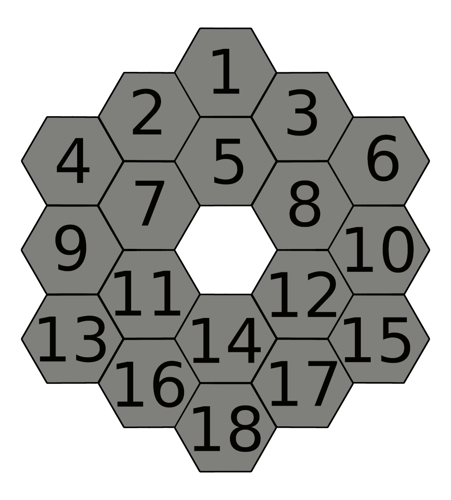

# JWST Collage Logo
I've been inspired by Hannah Wakeford's talk about Transmission 
spectroscopy during the
[SAGAN 2023 Workshop](https://nexsci.caltech.edu/workshop/2023/agenda.shtml) to
make a nice illustration, showing a combination of the JWST mirror 
arrangement and some early results from observations. All images are 
credited below, together with links on where to find them. The left-hand 
collage shows a full collection of recent results, mostly in imaging and 
exoplanet spectroscopy. All frames are individually editable, either to 
switch them with different (maybe at some point newer) results, or to 
highlight individual field (as exemplified on the right-hand side, where 
the exoplanet atmosphere observations are in focus).

    
    

## Image Sources
From top to bottom, left to right, half-row by half-row, the sources for 
the individual images are:
1. [NIRISS SOSS thermal emission spectrum of WASP-18 b](https://www.flickr.com/photos/nasawebbtelescope/52940667705/in/album-72177720305127361/) 
   (Credits: NASA/JPL-Caltech (R. Hurt/IPAC))
2. [MIRI Imaging Deep Field of the galaxy cluster SMACS 0723](https://www.flickr.com/photos/nasawebbtelescope/52210366419/in/album-72177720300469752/) 
   (Credits: NASA, ESA, CSA, and STScI)
3. [NIRCam and MIRI composite iamge of NGC 3256](https://www.flickr.com/photos/nasawebbtelescope/53019007937/in/album-72177720305127361/) 
   (Credits: ESA/Webb, NASA & CSA, L. Armus, A. Evans)
4. [NIRCam image of the dark molecular cloud Chamaeleon I](https://www.flickr.com/photos/nasawebbtelescope/52638633506/in/album-72177720305127361/) 
   (Image Credit: NASA, ESA, CSA, and M. Zamani (ESA). Science: M. K. 
   McClure (Leiden Observatory), F. Sun (Steward Observatory), Z. Smith 
   (Open University), and the Ice Age ERS Team)
5. [Composite image (CHANDRA and JWST) of the Eagle Nebula](https://www.flickr.com/photos/nasawebbtelescope/52920269941/in/album-72177720305127361/) 
   (Credit: X-ray: Chandra: NASA/CXC/SAO, XMM: ESA/XMM-Newton; IR: JWST: 
   NASA/ESA/CSA/STScI, Spitzer: NASA/JPL/CalTech; Optical: Hubble: 
   NASA/ESA/STScI, ESO; Image Processing: L. Frattare, J. Major, and K. Arcand)
6. [NIRCam image of the galaxy NGC 5068](https://www.flickr.com/photos/nasawebbtelescope/52945749968/in/album-72177720305127361/) 
   (Credit: ESA/Webb, NASA & CSA, J. Lee and the PHANGS-JWST Team) 
7. [NIRISS SOSS transmission spectrum of WASP-96 b](https://www.flickr.com/photos/nasawebbtelescope/52211811679/in/album-72177720300469752/) 
   (Credits: NASA, ESA, CSA, and STScI)
8. [NIRCam and MIRI composite image of the Carina nebula](https://www.flickr.com/photos/nasawebbtelescope/52259221868/in/album-72177720300469752/) 
   (Credits: NASA, ESA, CSA, and STScI)
9. [NIRCam image of the star-forming region Rho Ophiuchi](https://www.flickr.com/photos/nasawebbtelescope/53040527259/in/album-72177720305127361/) 
   (Credit: NASA, ESA, CSA, STScI, Klaus Pontoppidan (STScI), Image 
   Processing: Alyssa Pagan (STScI))
10. [NIRSpec transmission spectrum of GJ 486 b](https://www.flickr.com/photos/nasawebbtelescope/52862002049/in/album-72177720305127361/) 
    (Credits: NASA, ESA, CSA, Joseph Olmsted (STScI))
11. [NIRCam image of the protostar embedded in the dark cloud L1527](https://www.flickr.com/photos/nasawebbtelescope/52504158265/in/album-72177720301006030/) 
    (Image credit: NASA, ESA, CSA, STScI) 
12. [NIRCam image of the Orion bar](https://www.flickr.com/photos/nasawebbtelescope/53003114489/in/album-72177720305127361/) 
    (Credit: ESA/Webb, NASA, CSA, M. Zamani (ESA/Webb), PDRs4ALL ERS Team) 
13. [MIRI image of the Southern Ring planetary nebula](https://www.flickr.com/photos/nasawebbtelescope/52211582643/in/album-72177720300469752/) 
    (Credits: NASA, ESA, CSA, and STScI) 
14. [NIRSpec and MIRI composite image of Stephan's Quintet](https://www.flickr.com/photos/nasawebbtelescope/52210580092/in/album-72177720300469752/) 
    (Credits: NASA, ESA, CSA, and STScI) 
15. [NIRCam multi-filter composite image of Titan](https://www.flickr.com/photos/nasawebbtelescope/52536469908/in/album-72177720301006030/) 
    (Image credit: NASA, ESA, CSA, A. Pagan (STScI). Science: JWST Titan 
    GTO Team) 
16. [HST ACS and JWST MIRI composite image of M74](https://www.flickr.com/photos/nasawebbtelescope/52324839010/in/album-72177720301006030/) 
    (Image credit: ESA/Webb, NASA & CSA, J. Lee and the PHANGS-JWST Team; 
    ESA/Hubble & NASA, R. Chandar Acknowledgement: J. Schmidt)
17. [MIRI secondary eclipse photometry of TRAPPIST-1 c](https://www.flickr.com/photos/nasawebbtelescope/52988301957/in/album-72177720305127361/) 
    (Credits: NASA, ESA, CSA, Joseph Olmsted (STScI))
18. [NIRCam image of Saturn](https://www.flickr.com/photos/nasawebbtelescope/53013132440/in/album-72177720305127361/) 
    (Credit: NASA, ESA, CSA, STScI, Matt Tiscareno (SETI Institute), Matt 
    Hedman (University of Idaho), Maryame El Moutamid (Cornell University), 
    Mark Showalter (SETI Institute), Leigh Fletcher (University of 
    Leicester), Heidi Hammel (AURA). Image processing: J. DePasquale (STScI))

